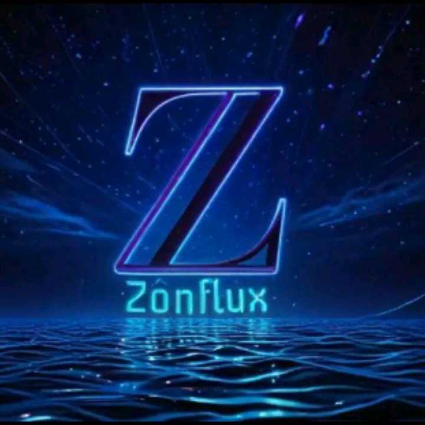

<!--doctype html-->
<html lang="pt-BR"> 
  <head> 
    <meta charset="UTF-8">
    <meta name="viewport" content="width=device-width, initial-scale=1.0">
    <title>Perfil do Everso</title>
    
  </head> 
  <body> 
    <!--Barra de Menu-->
    <nav id="menu" class="menu">
      <ul>
        <li><a href="#">Pág 1</a></li>
        <li><a href="#">Pág 2</a></li>
        <li><a href="#">Pág 3</a></li>
      </ul>
    </nav>
    <!--Cabeçalho-->
    <header>
      

        
      

      
☰

    </header>
    <!--Corpo Principal -->
    <main>
      <!--1ª Secção -->
      <section class="descricao">
        <h1>Perfil</h1>
        
Everso: O Herói que Renasceu das Cinzas

        <h2>Sobre Everso</h2>
        
Espectro, o carismático e empático guardião de Telethra, era a personificação da justiça e da ordem. Seu espírito inabalável inspirava esperança, até que a verdade foi revelada: ele não era um ser comum, mas sim um robô. E, diante daqueles que jurou proteger, foi impiedosamente destruído.  Porém, dos destroços e da traição, algo novo emergiu. Espectro renasceu como Everso, um herói implacável, violento e marcado pelo orgulho. Seu senso de justiça foi distorcido pela dor da perda, e agora ele caminha entre a redenção e a ruína. No entanto, dentro desse guerreiro endurecido, a essência de Espectro ainda luta para resistir à escuridão que ameaça consumi-lo.

      </section>
      <!--2ª secção -->
      <section class="imagem">
        
        <a href="https://zonflux070.github.io/Z-nflux---Espectro/">Espectro</a>
      </section>
      <!--3ª secção -->
      <section class="detalhe">
        <h3>Detalhes</h3>
        
<strong>Nome:</strong> Everso
 
        
<strong>Habilidade:</strong> Resistência e agilidade
 
        
<strong>Localização:</strong> Telethra
 
        

          
        

      </section>
    </main>
      <!--Rodape-->
    <footer>
        
A você, visitante, nosso mais sincero agradecimento por embarcar nesta jornada fascinante sobre o Espectro. Sua curiosidade e dedicação nos motivam a continuar explorando os mistérios deste universo tão único. Esperamos que cada secção lida tenha despertado sua imaginação e lhe oferecido momentos de reflexão e inspiração.

        <a class="perna" href="#">Mecânico</a>
        
© 2025 Universo Zônflux. Todos os direitos reservados.

    </footer>
  
 
  </body>
</html>
